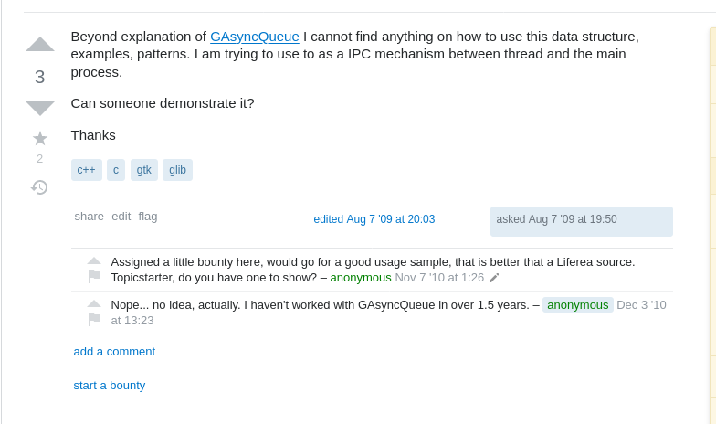

# faceless-stack-overflow
Does not show user info of OP and answerer, don't go to the comparing trap

Use Tampermonkey browser extension.

There is no any user information shown. Feel free to extend this script. Pull requests are welcome.
